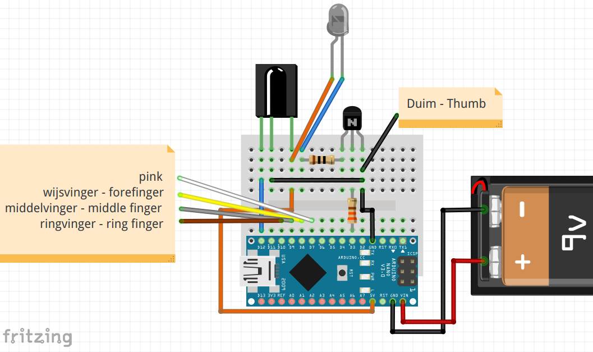
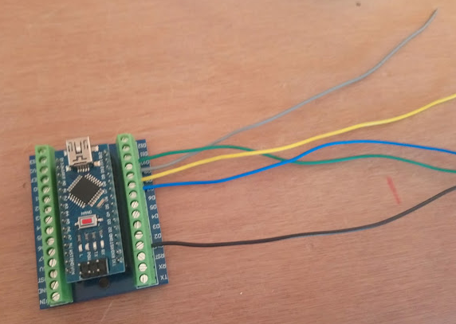

# IRGlove
Adaptatie van de GloveIR arduino code: a handschoen om IR toestellen te controleren.

## Base project
* [Phablabs.eu ir-glove project](http://phablabs.eu/workshop/ir-glove)
* [PDF Constructie handleiding](http://phablabs.eu/sites/default/files/Photonics%20IRglove_online_0.pdf)

Code is gebaseerd op record.ino van [IRLib2](https://github.com/cyborg5/IRLib2) welke GPL v3 is, dus deze code is ook GPL v3

## Constructie
We doen volgende wijzigingen tov het Phalabs project
* gebruik Arduino Nano
* gebruik Arduino Nano houder
* componenten bevestigen aan de Nano houder

# Handleiding

## Constructie op Breadboad
Maak indien gewenst eerst de constructie op een breadboard. Daarna kun je al de code flashen naar de Arduino, en testen.

## Constructie Foto Handleiding

### Electronisch circuit

We beginnen met de electronica klaarmaken. 

**Stap 1** 

Plaats de Nano op de Nano houder. Zorg dat pinnen juist zitten !

Maak draden die met de handschoen zullen verbinden voor de 5 fingers. Connecteer dan als volgt

* duim: GND zoals op foto
* wijsvinger: D10
* middelvinger: D9
* ringvinger: D8
* pink: D7

**Stap 2** 

De 9V batterijhouder connecteer je met Vin en GND aan de andere kant. Opgelet, Vin is **ROOD**.

**Stap 3** 

Soldeer de 330 Ohm weerstand aan middelste beentje van de transistor zoals op de foto. Dus, aan de platte kant
van de transistor!

**Stap 4** 

Bescherm nu middelste beentje transistor met een krimpkous.

Aan de *linkerkant* (als je kijkt op platte kant transistor) soldeer je de 10 Ohm weerstand. En daaraan dan een draad
die lang genoeg is om tot aan de knokels van je hand te lopen.

**Stap 5** 

Soldeer einde van die draad nu aan **korste** beentje van de IR LED (onze *zender*). Bescherm met krimpkous.

Het lange beentje van de IR LED is de +. Neem dan ook een **rode** draad, en soldeer hem eraan. Knip beentje LED
eerst wat korter dat je niet teveel krimpkous nodig hebt

**Stap 6** 

De rode draad van de IR LED stop je in de 5V van de NANO houder **samen** met **rechter** been van de IR ontvanger
(rechts als je kijkt naar de uitstulping).

**Stap 7** 

Om kortsluiting te vermijden, doe krimpkous over bovenkant van middelste been IR ontvangen, en stop deze dan, na 
plooien in de GND van de Arduino houder

Buig linkse been IR ontvanger naar achter.

**Stap 8** 

Soldeer een draad aan linkse been IR ontvanger, en bevestig andere uiteinde aan pin D12.

**Stap 9** 

Je hebt nu enkel nog de transistor die los zit. De *rechterkant* (als je kijkt op platte kant transistor) van de 
transistor moet in de GND, terwijl uiteinde van de 330 Ohm weerstand in pin D3 moet. Dat moet normaal
lukken zoals op volgende foto:

Je circuit is af. We moeten nu de vingers bevestigen aan de handschoen, en de IR LED plaatsen waar we signalen 
willen uitsturen.

### Handschoen

De handschoen kun je nu maken of eerst de code installeren om te testen.

## Code Installeren

### Benodigdheden
Installeer op je computer de Arduino IDE 1.8.8. 

Installeer dan via de library manager (`CTRL+SHIFT+I`) volgende bibliotheek:
* EEPROMEx versie 1.0.0 van Thijs Elenbaas

Vervolgens download via deze link [IRLib2](https://github.com/cyborg5/IRLib2) via de **Download Zip** knop (Wij gebruiken versie 3 Jun 2018). VOEG HIER SCREENSHOT TOE
Unzip de download, en kopieer **een deel** van de Download naar de Arduino library folder zodat deze volgende structuur heeft: 

    Arduino/libraries/IRLib2
    Arduino/libraries/IRLibFreq
    Arduino/libraries/IRLibProtocols
    Arduino/libraries/IRLibRecv
    Arduino/libraries/IRLibRecvPCI

Op Windows is dit normaal in locatie `C:\Users\USERNAME\Documents\Arduino`, op linux in `\home\USERNAME\Arduino`.

### IRGlove code - Standaard Code
#### Installatie
Download de code van deze git via de **Download zip** knop en unzip de download. 
Dubbel klik op de `IRGlove-master/IRGlove/IRGlove.ino` file in de unzipped code folder. Dit zal Arduino 1.8.8 openen op onze code. 

Selecteer als bord Arduino Nano. Druk op compileer om te code te verifieren. 

Krijg je de fout:

    lto1: internal compiler error: in lto_output_varpool_node, at lto-cgraph.c:624
    Please submit a full bug report,
    with preprocessed source if appropriate.

dan dien je oplossing uit [deze thread](https://forum.arduino.cc/index.php?topic=574020.0) uit te voeren als gevolg van bug [39](https://github.com/arduino/ArduinoCore-avr/issues/39):

    Tools > Board > Boards Manager
    Wait for downloads to finish. WAT IS DIT WACHTEN????
    When you move the mouse pointer over "Arduino AVR Boards", you will see a "Select version" dropdown menu appear. Select "1.6.21". SCREENSHOT
    Click "Install".
    Wait for installation to finish.
    Click "Close".

Na dit project kun je opnieuw de laatste versie van de *Arduino AVR Boards* installeren.

Laad de code op je Arduino Nano.

#### Werking Code
De code werkt volgens een *state machine*, in het Nederlands *Eindigetoestandsautomaat*. Is het de eerste keer dat je de code oplaad, dan moet je nog programmeren wat de vingers moeten doen. 

De toestanden van de code zijn als volgt:

Je gebruikt dus de pink (verbonden aan pin 7 van de Arduino) om tussen de toestanden te schakelen, kiest de vinger die je wil programmeren, en stuurt een IR bericht om dit op te slaat. Kijk naar de interne LED om te weten in welke toestand de Arduino Nano zich bevindt.

### IRGlove code - Test Code
#### Installatie
Download de code van deze git via de **Download zip** knop en unzip de download. 
Dubbel klik op de `IRGlove-master/IRGlove_SerialProgrammed/IRGlove_SerialProgrammed.ino` file in de unzipped code folder. Dit zal Arduino 1.8.8 openen op onze code. 

Selecteer als bord Arduino Nano. Druk op compileer om te code te verifieren. 

Krijg je de fout:

    lto1: internal compiler error: in lto_output_varpool_node, at lto-cgraph.c:624
    Please submit a full bug report,
    with preprocessed source if appropriate.

volg dan de oplossing hierboven gegeven bij standaard code.

#### Werking
Bij de test code hou je de Arduino Nano verbonden met de PC, en open je de Seriele monitor. Je kan via de seriele monitor de opdracht doorgeven om IR signalen op te slaan. Je krijgt feedback op de seriele monitor van ontvangen IR codes en uitgestuurde IR codes. Dit helpt je in begrijpen of een bepaalde IR code correct geinterpreteerd wordt door de code.

Merk op dat dit deel van de code ook beschikbaar is in de standaard code. Om de seriele monitor aan te schakelen voor de standaard code dien je enkel volgende lijn te zoeken in de `.ino` file

    // set serial output on or off
    #define TEST_WITH_SERIAL false

en wijzigen in 

    // set serial output on or off
    #define TEST_WITH_SERIAL true

