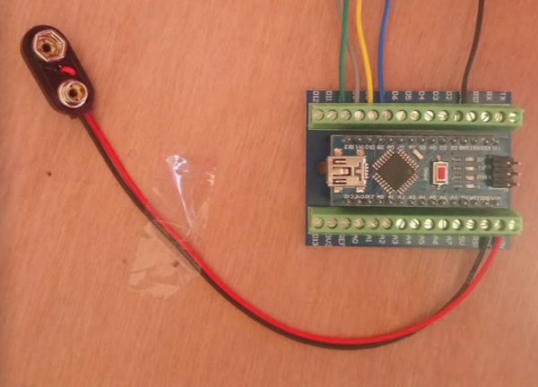
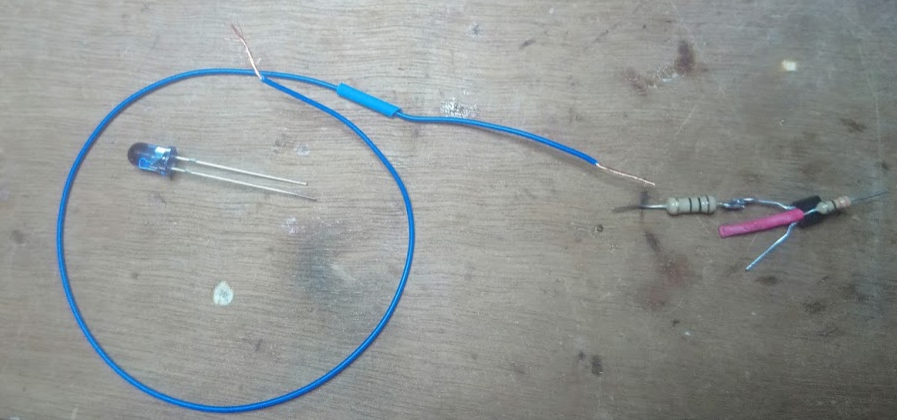
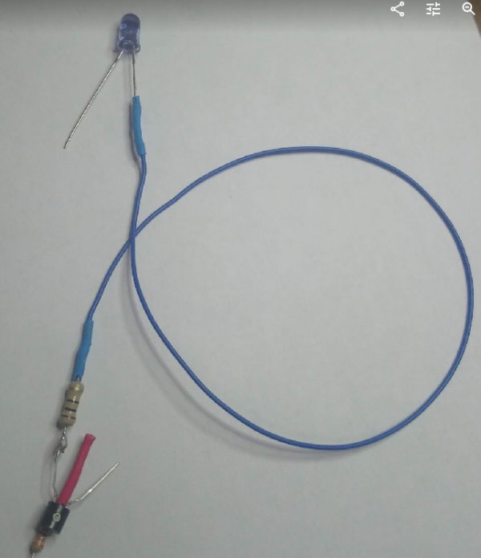
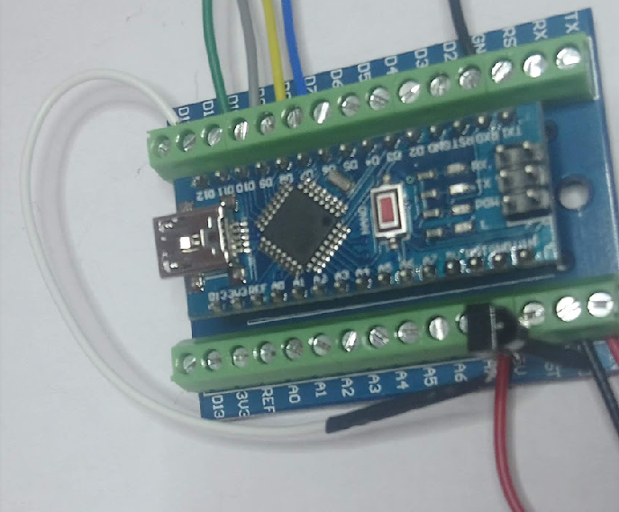
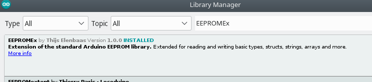

# IRGlove

Here we describe an adaptation of the GloveIR project of Phablabs: a glove to control IR enabled devices

**Dutch**: See [Dutch Manual](README.md) 

## Base project

The original phablabs project can be found here: 

* [Phablabs.eu ir-glove project](http://phablabs.eu/workshop/ir-glove)
* [PDF Construction manual](http://phablabs.eu/sites/default/files/Photonics%20IRglove_online_0.pdf)

The Code is based on `record.ino` of [IRLib2](https://github.com/cyborg5/IRLib2) which is GPL v3, so this manual is also under licence GPL v3.

## Construction
We do following changes to the Phalabs project
* use Arduino Nano
* use Arduino Nano holder
* components attached directly to the Nano holder
* stand-alone version: glove can record and send IR without the need of a PC

# Manual

## Construction on Breadboad
If you which, make first the construction on a breadboard. After this you can flash the code to the Arduino and test

## Construction Photo Manual

### Electronical circuit

We start with preparing the electronics

**Step 1** 

Put the Nano on the Nano holder. Make sure the pin numbers are correct with those written on the holder !

Make wires which we later will connect with the glove for the 5. Connect them as follows

* thumb: GND as on the picture
* forefinger: D10
* middel finger: D9
* ring finger: D8
* pink: D7

**Step 2** 

The 9V battery holder must be connected with Vin and GND at the other side. Careful, Vin is **RED**.

**Step 3** 

Solder the 330 Ohm resistor to the middle leg of the transistor as in the picture foto. So, over the flat side of the transistor!

**Step 4** 

Protect now the middle leg of the transistor with a heat shrink tubing.

On the *left side* (looking on the flat side of the transistor) solder now the 10 Ohm resistor. To that solder then a wire sufficiently long to reach the knuckles of your hand when installed.

**Step 5** 

Solder now the end of this wire to the **shortest** leg of the IR LED (our *transmitter*). Protect with heat shrink tubing.

The long leg of the IR LED is the +. So take a **red** wire, and solder it to this leg. Shorten the LED leg
first somewhat so you don't need much heat shrink tubing to protect it.

**Step 6** 

The red zire of the IR LED you screw to the 5V of the NANO holder **together** with the **right** leg of the IR receiver
(right side when looking at the protrusion on the receiver).

**Step 7** 

To qvoid short circuit, apply heat shrink tubing on the middle leg of the IR receiver and put this middle leg then, after bending; in the GND of the Arduino holder. The receiver should stick out so you can easily point to it with a telecommand

Bend the left leg of the IR receiver backwards

**Step 8** 

Solder a wire to the left leg of the IR receiver, and connect the othe side to pin D12.

**Step 9** 

You are only left with the transistor which is not fully connected yet. The *right side* (when looking at the flat side of the transistor) of the 
transistor must go to GND, while the end of the 330 Ohm resistor you connected earlier must go in pin D3 moet. 
You should be able to this like on the following picture:

**Step 10**
Your circuit is finished. We must now connect the vingers to the glove, and place the IR LED where we want the signals to be emitted fromf. The finished circuit should look like this:

### Glove

The glove can now be made, or you install first the code to test the device.

## Install Code 

### Requirements
Install first on your PC Arduino IDE 1.8.8. 

Install then via the library manager (`CTRL+SHIFT+I`) following library:
* EEPROMEx version 1.0.0 of Thijs Elenbaas

Next, download via this link [IRLib2](https://github.com/cyborg5/IRLib2) via the **Download Zip** button (We used version 3 Jun 2018). VOEG HIER SCREENSHOT TOE
Unzip the download, and copyr **a partl** of the Download to the Arduino library directory so that this would contain following structure:

    Arduino/libraries/IRLib2
    Arduino/libraries/IRLibFreq
    Arduino/libraries/IRLibProtocols
    Arduino/libraries/IRLibRecv
    Arduino/libraries/IRLibRecvPCI

On Windows this is normally in location `C:\Users\USERNAME\Documents\Arduino`, on linux in `\home\USERNAME\Arduino`.

### IRGlove code - Standard Code
#### Installation
Download the code of this git using the **Download zip** button and en unzip the download. 
Double click on the `IRGlove-master/IRGlove/IRGlove.ino` file in thee unzipped code directory. This wil open Arduino 1.8.8 with our code. 

Select as board Arduino Nano. Press on Compile in the IDE to verify the code. 

If you obtain following errort:

    lto1: internal compiler error: in lto_output_varpool_node, at lto-cgraph.c:624
    Please submit a full bug report,
    with preprocessed source if appropriate.

then you must apply the solution from [this thread](https://forum.arduino.cc/index.php?topic=574020.0) as a consequence of bug [39](https://github.com/arduino/ArduinoCore-avr/issues/39):

    Tools > Board > Boards Manager
    Wait for downloads to finish.
    When you move the mouse pointer over "Arduino AVR Boards", you will see a "Select version" dropdown menu appear. Select "1.6.21". SCREENSHOT
    Click "Install".
    Wait for installation to finish.
    Click "Close".

After finishing this project, you can install again the lastest version via *Arduino AVR Boards*.

Upload the code on your Arduino Nano.

#### How does the Code work?
The code works using a *state machine*. If this is the first time you use the code, you must still program what the fingers must do. 

The different states are as follows:

You use your pink (connected to pin 7 of the Arduino) to switch between states, then choose the finger you want to program, and send an IR message to save this as action for this finger. Watch the internal LED to watch which state the Arduino Nano is in.

The LED is out in the normal state, when the device emits IR codes. This means only the POWER LED is on:

While the device waits on the finger selected to be programmed; the LED flashes on and off. Once you selected a finger to program, the device waits for an IR code to arrive and store, which is indicated with the LED which will be on.

As soon as a code has been received, the LED switches off again.

Do you want to know how we programmed this state machine? The basis was made with our block code editor, and then integrated with the code. You can investigate the state machine via [our block code editor](http://blokkencode.ingegno.be/index_en.html) where you should upload following xml to see the blocks: [ProgramStates.xml](doc/ProgramStates.xml)

### IRGlove code - Test Code
#### Installation
Download the code of this git via de **Download zip** button and unzip the download. 
Double click on the `IRGlove-master/IRGlove_SerialProgrammed/IRGlove_SerialProgrammed.ino` file in the unzipped code directory. This will open the Arduino 1.8.8 IDE. 

Select as board the Arduino Nano. Press the compile button to verify the code. 

Do you obtain the error:

    lto1: internal compiler error: in lto_output_varpool_node, at lto-cgraph.c:624
    Please submit a full bug report,
    with preprocessed source if appropriate.

follow then the solution given above in the standard code section.

#### How does it work
For this test code you need to keep the device connected to the PC using a USB cable, and then you need to open the Serial Monitor. You can give commands via the serial monitor to order the device to record IR signals. You obtain feedback on the serial monitor about the received and send IR codes. This helps to understand if a certain IR code was correctly understood by the Arduino.

Remark: this test code is also available in the standard code, but disabled by default. To switch on the serial monitor in the standard code, search for following line in the  `.ino` file

    // set serial output on or off
    #define TEST_WITH_SERIAL false

and change it into

    // set serial output on or off
    #define TEST_WITH_SERIAL true

