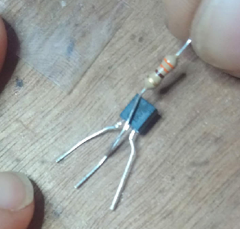
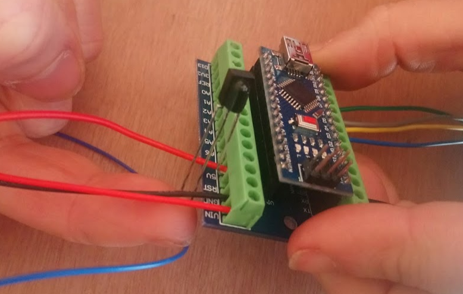

# IRGlove

Here we describe an adaptation of the GloveIR project of Phablabs: a glove to control IR enabled devices

**Dutch**: See [Dutch Manual](README.md) 

## Base project

The original phablabs project can be found here: 

* [Phablabs.eu ir-glove project](http://phablabs.eu/workshop/ir-glove)
* [PDF Construction manual](http://phablabs.eu/sites/default/files/Photonics%20IRglove_online_0.pdf)

The Code is based on `record.ino` of [IRLib2](https://github.com/cyborg5/IRLib2) which is GPL v3, so this manual is also under licence GPL v3.

## Construction
We do following changes to the Phalabs project
* use Arduino Nano
* use Arduino Nano holder
* components attached directly to the Nano holder
* stand-alone version: glove can record and send IR without the need of a PC

# Manual

## Construction on Breadboad
If you which, make first the construction on a breadboard. After this you can flash the code to the Arduino and test

## Construction Photo Manual

### Electronical circuit

We start with preparing the electronics

**Step 1** 

Put the Nano on the Nano holder. Make sure the pin numbers are correct with those written on the holder !

Make wires which we later will connect with the glove for the 5. Connect them as follows

* thumb: GND as on the picture
* forefinger: D10
* middel finger: D9
* ring finger: D8
* pink: D7

**Step 2** 

The 9V battery holder must be connected with Vin and GND at the other side. Careful, Vin is **RED**.

**Step 3** 

Solder the 330 Ohm resistor to the middle leg of the transistor as in the picture foto. So, over the flat side of the transistor!

**Step 4** 

Protect now the middle leg of the transistor with a heat shrink tubing.

On the *left side* (looking on the flat side of the transistor) solder now the 10 Ohm resistor. To that solder then a wire sufficiently long to reach the knuckles of your hand when installed.

**Step 5** 

Solder now the end of this wire to the **shortest** leg of the IR LED (our *transmitter*). Protect with heat shrink tubing.

The long leg of the IR LED is the +. So take a **red** wire, and solder it to this leg. Shorten the LED leg
first somewhat so you don't need much heat shrink tubing to protect it.

**Step 6** 

The red zire of the IR LED you screw to the 5V of the NANO holder **together** with the **right** leg of the IR receiver
(right side when looking at the protrusion on the receiver).

**Step 7** 

To qvoid short circuit, apply heat shrink tubing on the middle leg of the IR receiver and put this middle leg then, after bending; in the GND of the Arduino holder. The receiver should stick out so you can easily point to it with a telecommand

Bend the left leg of the IR receiver backwards

**Step 8** 

Solder a wire to the left leg of the IR receiver, and connect the othe side to pin D12.

**Step 9** 

You are only left with the transistor which is not fully connected yet. The *right side* (when looking at the flat side of the transistor) of the 
transistor must go to GND, while the end of the 330 Ohm resistor you connected earlier must go in pin D3 moet. 
You should be able to this like on the following picture:

**Step 10**
Your circuit is finished. We must now connect the vingers to the glove, and place the IR LED where we want the signals to be emitted fromf. The finished circuit should look like this:

### Glove

The glove can now be made, or you install first the code to test the device.

## Install Code 

### Requirements
Install first on your PC Arduino IDE 1.8.8. 

Install then via the library manager (`CTRL+SHIFT+I`) following library:
* EEPROMEx version 1.0.0 of Thijs Elenbaas

Next, download via this link [IRLib2](https://github.com/cyborg5/IRLib2) via the **Download Zip** button (We used version 3 Jun 2018). VOEG HIER SCREENSHOT TOE
Unzip de download, en kopieer **een deel** van de Download naar de Arduino library folder zodat deze volgende structuur heeft: 

    Arduino/libraries/IRLib2
    Arduino/libraries/IRLibFreq
    Arduino/libraries/IRLibProtocols
    Arduino/libraries/IRLibRecv
    Arduino/libraries/IRLibRecvPCI

Op Windows is dit normaal in locatie `C:\Users\USERNAME\Documents\Arduino`, op linux in `\home\USERNAME\Arduino`.

### IRGlove code - Standaard Code
#### Installatie
Download de code van deze git via de **Download zip** knop en unzip de download. 
Dubbel klik op de `IRGlove-master/IRGlove/IRGlove.ino` file in de unzipped code folder. Dit zal Arduino 1.8.8 openen op onze code. 

Selecteer als bord Arduino Nano. Druk op compileer om te code te verifieren. 

Krijg je de fout:

    lto1: internal compiler error: in lto_output_varpool_node, at lto-cgraph.c:624
    Please submit a full bug report,
    with preprocessed source if appropriate.

dan dien je oplossing uit [deze thread](https://forum.arduino.cc/index.php?topic=574020.0) uit te voeren als gevolg van bug [39](https://github.com/arduino/ArduinoCore-avr/issues/39):

    Tools > Board > Boards Manager
    Wait for downloads to finish. WAT IS DIT WACHTEN????
    When you move the mouse pointer over "Arduino AVR Boards", you will see a "Select version" dropdown menu appear. Select "1.6.21". SCREENSHOT
    Click "Install".
    Wait for installation to finish.
    Click "Close".

Na dit project kun je opnieuw de laatste versie van de *Arduino AVR Boards* installeren.

Laad de code op je Arduino Nano.

#### Werking Code
De code werkt volgens een *state machine*, in het Nederlands *Eindigetoestandsautomaat*. Is het de eerste keer dat je de code oplaad, dan moet je nog programmeren wat de vingers moeten doen. 

De toestanden van de code zijn als volgt:

Je gebruikt dus de pink (verbonden aan pin 7 van de Arduino) om tussen de toestanden te schakelen, kiest de vinger die je wil programmeren, en stuurt een IR bericht om dit op te slaat. Kijk naar de interne LED om te weten in welke toestand de Arduino Nano zich bevindt.

De LED is uit in de normale werking als codes uitgestuurd worden. Dit betekend dat enkel de POWER LED brandt:

Terwijl gewacht wordt om een vinger te kiezen om te programmeren flikkert de LED aan en uit. Als er gewacht wordt op een IR code van een telecommando, zal de LED aan zijn.

Zodra een code ontvangen is, schakelt de LED weer uit.

Wil je weten hoe deze eindigetoestandsautomaat geprogrammeerd werd? De basis werd in onze blokkencode gemaakt en dan geintegreerd in de code. Je kan de automaat bekijken via [onze blokkencode](http://blokkencode.ingegno.be/) waar je volgende xml moet opladen: [ProgramStates.xml](doc/ProgramStates.xml)

### IRGlove code - Test Code
#### Installatie
Download de code van deze git via de **Download zip** knop en unzip de download. 
Dubbel klik op de `IRGlove-master/IRGlove_SerialProgrammed/IRGlove_SerialProgrammed.ino` file in de unzipped code folder. Dit zal Arduino 1.8.8 openen op onze code. 

Selecteer als bord Arduino Nano. Druk op compileer om te code te verifieren. 

Krijg je de fout:

    lto1: internal compiler error: in lto_output_varpool_node, at lto-cgraph.c:624
    Please submit a full bug report,
    with preprocessed source if appropriate.

volg dan de oplossing hierboven gegeven bij standaard code.

#### Werking
Bij de test code hou je de Arduino Nano verbonden met de PC, en open je de Seriele monitor. Je kan via de seriele monitor de opdracht doorgeven om IR signalen op te slaan. Je krijgt feedback op de seriele monitor van ontvangen IR codes en uitgestuurde IR codes. Dit helpt je in begrijpen of een bepaalde IR code correct geinterpreteerd wordt door de code.

Merk op dat dit deel van de code ook beschikbaar is in de standaard code. Om de seriele monitor aan te schakelen voor de standaard code dien je enkel volgende lijn te zoeken in de `.ino` file

    // set serial output on or off
    #define TEST_WITH_SERIAL false

en wijzigen in 

    // set serial output on or off
    #define TEST_WITH_SERIAL true

